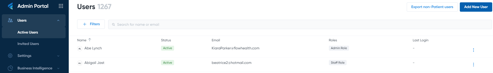

Viewing active users
=====================

LIS allows laboratory administrators to view a list of all system users whose role is different from `Patient` through the Users > Active Users section in the Admin Portal. The The filtering is combined with search. In the main table view of the screen Name, Status and Roles are visible. Last login column is out of scope. Search will only look-up for active Users at first implementation.

.. note::

   All annotations and markups can still be edited when you re-open the document
   
Walk-through of an example annotation
########

To give you a taste of what **GroupDocs PDF Annotator** brings to the table, here is an example using the simplest way to annotate a PDF.

In the example below, an annotation area is added to a User Guide draft (PDF filename is ``UG_draft``) sent for review:

To accomplish this via the **GroupDocs PDF Annotator** API, the following request needs to be executed::

    using (Annotator annotator = new Annotator("UG_draft.pdf"))
	{
	AreaAnnotation area = new AreaAnnotation
    {
     	BackgroundColor = 0000ffff,
        Box = new Rectangle(100, 100, 100, 100),
        CreatedOn = DateTime.Now,
        Message = "Too much, set to 5",
        Opacity = 0.7,
        PageNumber = 0,
        PenColor = 65535,
        PenStyle = PenStyle.Dot,
        PenWidth = 3,
        Replies = new List<Reply>
        {
        	new Reply
            {
            	Comment = "First comment",
                RepliedOn = DateTime.Now
            },
            new Reply
            {
            	Comment = "Second comment",
                RepliedOn = DateTime.Now
            }
        }
    };
    annotator.Add(area);
    annotator.Save("result.pdf");
	}

What just happened?
-------------------

When you called the ``Add`` method and passed the ``AreaAnnotation`` command, the Annotator looked for an Annotation Area definition inside it and ran it through the engine. The engine started making requests to the URLs defined in the call properties, passing the values you provided as an argument. For more details on this command, see :doc:`api`

Here you notice one of the main advantages about our Annotator: it gives you full control over the resulting annotation through a few self-explanatory settings. You can concurrently modify attributes like opacity, pen color, or even the annotation message through the request syntax and the result will be consistently accurate and impressively fast.

Is there anything else?
-------------------
You bet! You’ve seen how to create an annotation area, but this is just the surface. **GroupDocs PDF Annotator** provides a lot of powerful features for making the workflow easy and efficient, such as leaving comments, drawing figures, calculating distances, highlighting and marking up documents, and much more.

What's next?
-------------------
The next steps for you are to follow through the tutorial to learn how to create a full-blown **GroupDocs PDF Annotator** project as described in :doc:`usage`.

