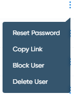

Managing Users
================

Controlling and managing user access is a fundamental security essential for any organization. LIS enables Super Admins to control user access and on-board and off-board users to and from the platform.

User management options differ according to the particular role. To view the options available for a particular user, click on the respective ellipsis icon. A drop-down window similar to the below will appear: 

Each option is described in detail in the table below:

.. table::
====================  =============================================================
Option                Description
====================  =============================================================
**Reset Password**    Invalidates the current user password and sends an email to
                      the user prompting them to create a new password. 
**Copy Link**         Copies the link to the user profile to the buffer, allowing
                      you to use it for referral.
**Block User**        Selecting this option renders the user unable to access LIS. 
                      This is a temprorary measure that can be reverted by 
                      selecting **Unblock User**. 
**Unblock User**      This option is available for blocked users only. Selecting
                      it restores all user's permissions and allows them to
                      access LIS.
**Delete User**       Deleting a user from LIS will permanently delete their profile
                      and all of their associated data.
====================  =============================================================
