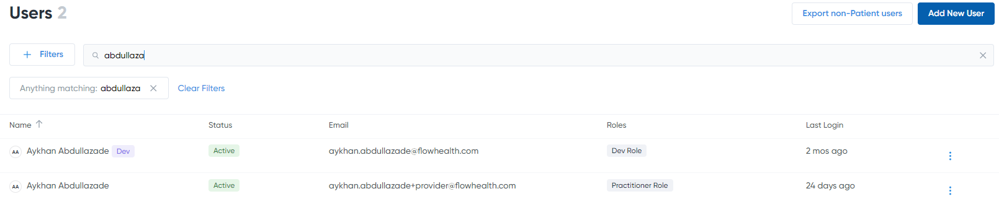

Searching for Non-Patients 
==========================

To give you a taste of what the **Search** functionality brings to the table, start typing a user name in the **Search** field. As you type, a list of suggested matches appears below the search field based on what you’ve entered:

Click the guest’s name when you see it in the list. The guest profile block appears.
In a similar fashion, you can also search guests by their:

Is there anything else?
-------------------
You bet! You’ve seen how to create an annotation area, but this is just the surface. **GroupDocs PDF Annotator** provides a lot of powerful features for making the workflow easy and efficient, such as leaving comments, drawing figures, calculating distances, highlighting and marking up documents, and much more.
