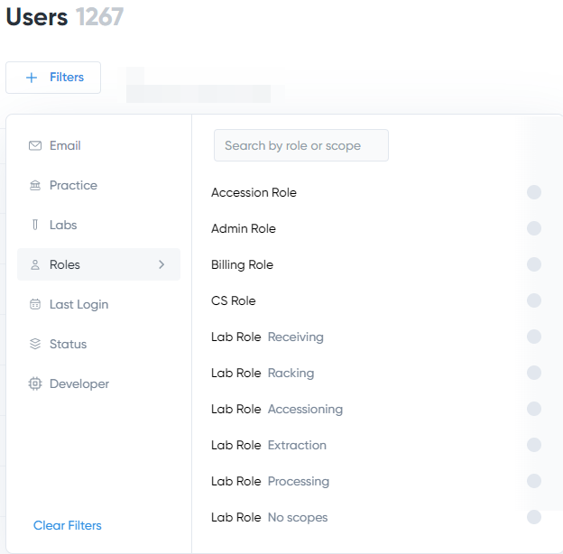

Applying Filters
================

The easiest way to find a required user is to use the **Filters** panel found underneath the **Users** page name:
 

The panel features the following filtering options:

.. table::
====================  =============================================================
Option                Description
====================  =============================================================
**Email**             Check the appropriate option to display the users whose 
                      email address is in the ``flowhealth`` domain 
                      (``FH Employees``)
                      or in any other domain (``Non FH Employees``). 
**Practice**          Select a practice name to display only the users associated
                      with this practice.
**Labs**              Select a laboratory name to display only the users associated
                      with this laboratory.
**Roles**             Select a role to display only the users assigned this role
**Last Login**        Check an option to display only the users whose most recent
                      login occurred within the specific period. To define
                      the required period more precisely, click **Custom
                      Date Range**.
**Status**            Check the appropriate option to display only the users
                      with a specific status. 
**Developer**         Check the appropriate option to display only the users with
                      the ``Dev`` role (``Developers``) or with any other role
                      (``Non-Developers``).
====================  =============================================================

What's next?
-------------------
If you are assigned the ``Super Admin`` role, proceed to the :doc:`manage` topic to learn which user management options are available for different user roles.

